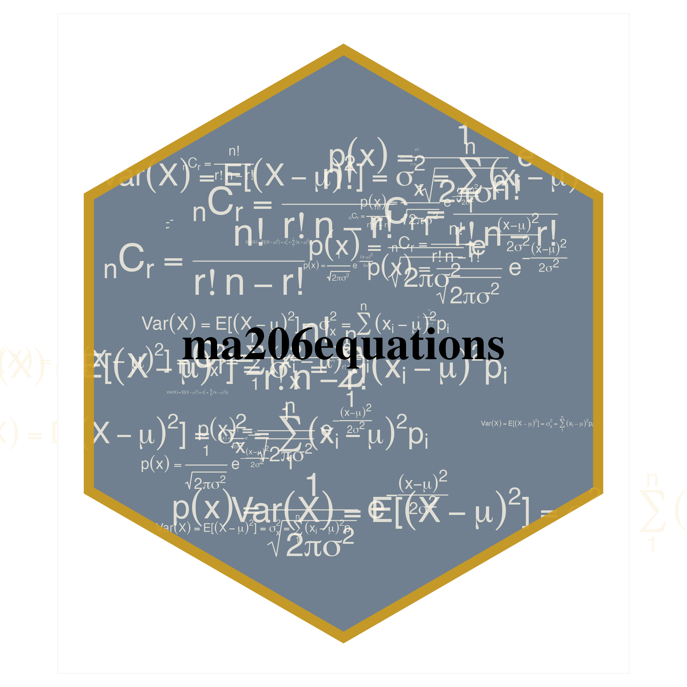
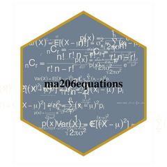
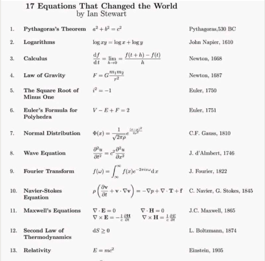

<!-- README.md is generated from README.Rmd. Please edit that file -->

```{r, include = FALSE}
knitr::opts_chunk$set(
  collapse = TRUE,
  comment = "#>",
  fig.path = "man/figures/README-",
  out.width = "100%",
  cache = F
)
```


```{r, eval = F, echo = F}
library(tidyverse)
library(ggstamp)  
library(ggxmean)
set.seed(1243)
ggcanvas() + 
  stamp_wash(fill = "slategrey", alpha = 1) + 
  # stamp_normal_dist(height = 20) +
  ma206equations::stamp_eq_normal(color = "oldlace",
                                    size = runif(10)*10,
                                  fontface = "bold",
                                    y = runif(10)-.5, 
                                    alpha = .8,
                                    x = runif(10)-.5)  + 
    ma206equations::stamp_eq_choose(color = "oldlace",
                                    size = runif(10)*10,
                                  fontface = "bold",
                                    y = runif(10)-.5, 
                                    alpha = .8,
                                    x = runif(10)-.5)  + 
      ma206equations::stamp_eq_variance(color = "oldlace",
                                    size = runif(10)*10,
                                  fontface = "bold",
                                    y = runif(10)-.5, 
                                    alpha = .8,
                                    x = runif(10)-.5)  + 
    stamp_text( y = 0, x = 0,
             label = "ma206equations",
             color = "black", size = 12) + 
    stamp_polygon(radius = .75, x0 = 0, y0 = 0,
                alpha = 0, size = 7,
                color = alpha("goldenrod3", .9)) +
    stamp_polygon_inverse(radius = .75, radius_outer = Inf, x0 = 0, y0 = 0,
                        fill = "white", color = "red"
                         ) +
  theme_void_fill(fill = "white") +
  NULL
  
```


```{r, eval = F, echo = F}
ggsave("hex_sticker_dist.png", dpi = 320) 
magick::image_read("hex_sticker_dist.png") %>% 
  magick::image_fill("transparent",  "+40+40", fuzz = 40) %>% 
  magick::image_write("hex_sticker_dist.png")


```


# ma206equations 

[](https://lifecycle.r-lib.org/articles/stages.html#experimental)


Delivering type-setting equations in prose and plots as functions for statistics and probability curricula

## Abstract 

Mathematical fluency involves frequent use of equations. However, typing out equations for use in electronic documents can be tedious. In a classroom setting with a set curriculum, the set of equations to be mastered is well defined. Having shortcuts to produce this set of equations in prose or plots could be beneficial for students and instructors alike.  The goal of this independent study is to create functions that will quickly deliver the typed versions of equations that translate into beautiful printed versions. We will store the typed versions and thoughtfully crafted R functions to make these typed equations easily accessible. The functions will be bundled into an R package.


# The problem

Using mathematical notation is a powerful way to communicate about probabilistic and statistical concept.  When notation is combined with data visualization or descriptive prose that power is even greater.  

However, using equations in these contexts is often done by typing in a typesetting version of the equation; this can be awkward.  Consider the probability density function for the normal distribution, centered at $\mu$ with a standard deviation of $\sigma$:

```{r, warning=F, out.width="20%", echo = F}
math_plot_normal <- "p(x) * {phantom() == phantom()} * frac(1, sqrt(2*pi*sigma^{2}, )) * phantom(.)*e^{phantom() - frac((x - mu)^{2}, 2*sigma^{2})} "

library(ggplot2)
ggxmean:::stamp_space() + 
  annotate(geom = "text", 
           label = math_plot_normal,
           parse = T,
           x = 2, y = .3, size = 20) + 
  coord_cartesian(expand = FALSE) + 
  theme_void()
```

The typed version of this equation which follows is a distant cousin from its beautiful rendered kin above:

`p(x) = \frac{1}{\sqrt{ 2 \pi \sigma^2 }} e^{ - \frac{ (x - \mu)^2 } {2 \sigma^2} }`

Furthermore, if we want to use annotate a plot with this equation, we would need to use plotmath, a completely different type setting system.

`p(x) * {phantom() == phantom()} * frac(1, sqrt(2*pi*sigma^{2}, )) * phantom(.)*e^{phantom() - frac((x - mu)^{2}, 2*sigma^{2})} `

```{r, warning=F}
library(ggplot2)
ggxmean:::stamp_space() + 
  ggxmean::stamp_normal_dist() +
  annotate(geom = "text", 
           label = "p(x) * {phantom() == phantom()} * frac(1, sqrt(2*pi*sigma^{2}, )) * phantom(.)*e^{phantom() - frac((x - mu)^{2}, 2*sigma^{2})} ",
           parse = T,
           x = 2, y = .3)
```

# A different work flow within intro probability and statistics course work...

What if we could call a function to get back the text that will render to our beautiful equations. For example a function like `typeset_eq_normal()` could be called to get the typed version of the prose and `stamp_eq_normal()` for use in ggplot2.

Our package ma206equations delivers exactly this. ma206equations delivers tex version of equations that can be used in prose, as shown here:

```{r}
ma206equations::typeset_eq_normal()
```

Educators can call this equation and then copy and paste into hybrid prose-code documents, or use in-line code to return the equation dynamically: 
$$p(x) = \frac{1}{\sqrt{ 2 \pi \sigma^2 }} e^{ - \frac{ (x - \mu)^2 } {2 \sigma^2} }$$

```{verbatim}
This is an example of how to return an equation inline: 
  
`r ma206equations::typeset_eq_normal(inline = TRUE)`

```


This is an example of how to return an equation inline: `r ma206equations::typeset_eq_normal(inline = TRUE)`

To use equations in a plotting context, ma206equations provides stamp_eq_*() functions.  An example of how to print the normal distribution equation with ma206equations follows:

```{r}
library(ggplot2)
library(ma206equations)
ggxmean:::stamp_space() + 
  ma206equations::stamp_eq_normal(x = 2, y = .3) + 
  ggxmean::stamp_normal_dist()
```

# Further examples, binomial distribution, geometric distribution, discrete random...

For further examples that complement the work in ma206distributions, please check out that package [here](https://evamaerey.github.io/ma206distributions/).


# metaprogramming maintanance strategy: code that writes code

At first we worked on writing functions one by one. However, doing so for the large number of equations that we thought might be useful did not seems sustainable.  Therefore we turned to a meta-programming:

> Meta-Programming is a programming technique in which computer programs have the ability to treat programs as their data.It means that a program can be designed to read, generate, analyse or transform other programs, and even modify itself while running. Meta Programming is about writing code that writes code. (Anshul Vyas)

The meta programming files are included in data-raw folder of this package.  The components are 

1) spreadsheet of equations of interest for ma206, descriptions etc.
2) function composition and testing files 
3) function template files 
4) r package function generation code from templates and spreadsheet

## 1 'data' collection

A large part of this project was thinking about which equations are relevant for a course like ma206. 

```{r}
read.csv("data-raw/ma389_stats_formulas.csv") |>
  dplyr::select(-long_description) |>
  tail(7) |> 
  knitr::kable()
```

## 2. Work on specific functions that serve as a reference for how remainder should look.

Here we just considered specific functions: [here](https://github.com/EvaMaeRey/ma206equations/blob/main/data-raw/plotmath_functions_playpen.Rmd).

## 3. Write templates for generating a lot of functions and their documentation

```{r}
# for preparation of stamp functions
readLines("data-raw/plotmath_equations_template.txt")
```

## 4. Use template and spreadsheet w/ meta code to create package functions

To see exactly how we used the template to generate all the functions for this package, see the processing code [here](https://github.com/EvaMaeRey/ma206equations/blob/main/data-raw/process_excel_file.Rmd).

The function files are the following: 

```{r}
list.files("R/")
```


---

<!-- Fortunately, a translater exists. -->

<!-- ```{r} -->
<!-- exp_to_plot <- latex2exp::TeX("$p(x) = \\frac{1}{\\sqrt{ 2 \\pi \\sigma^2 }} e^{ - \\frac{ (x - \\mu)^2 } {2 \\sigma^2} }$") -->
<!-- ``` -->


# Ideas for selling the project!  

Consider Ian Stewart's poster below, 'Equations that changed the world.'  We see the equations themselves and a verbal way to refer to the equations - the equation's name.  The typesetting version, thankfully, does not appear.  

In a setting where you are using software, it might be preferable to refer to the equation by name rather than always typing of the typesetting version.  For example `typeset_pathagoreans()` could return `$ a^2 + b^2 = c^2 $` which could be copy and pasted or used dynamically in a hybrid prose/code document like jupiter notebooks, rmarkdown, or quarto.  

```{r}

```

---

```{r}
knitr::include_graphics("https://i.kym-cdn.com/photos/images/newsfeed/001/179/540/554.jpg")
```

'After the math symbols were added, the image and gif surged in popularity, particularly on Brazilian parts of social media, before it grew popular worldwide.' "https://knowyourmeme.com/memes/math-lady-confused-lady"

Chat GPT prompt: Why is the 'when a woman says she's 29 weeks pregnant' meme funny?

> The "when a woman says she's 29 weeks pregnant" meme is a humorous observation on the specificity with which women tend to describe their pregnancy progress. The joke is that a woman who says she is 29 weeks pregnant is providing a level of detail that is more than necessary for most people, and can be seen as somewhat comical.

> The meme often features a photo or image of a person with a confused or bewildered expression, with text overlayed that reads something along the lines of "me trying to figure out how many months that is." The humor comes from the idea that it can be difficult for people who are not pregnant or familiar with pregnancy terminology to understand what is meant by phrases like "29 weeks."

> In short, the meme is funny because it pokes fun at the precision with which pregnant women tend to describe their pregnancy progress, and the confusion that can result when that level of detail is shared with others who are not as familiar with the terminology.


---

# Internal project management notes

# Project refereences:

See also: https://github.com/EvaMaeRey/ay_2023_2_advanced_individual_study


# How do we write a package?


- We will still follow the steps outlined in this data package readme: https://github.com/EvaMaeRey/tidytitanic
- As well as consult the package building guide: https://evamaerey.github.io/package_in_20_minutes/package_in_20_minutes

## Which equations are relevant for the statistics and probability course?

A good start for looking at the core of equations used in ma206 is the code annex:

- Rendered:  https://evamaerey.github.io/ma206/code_annex.html
- Source: https://github.com/EvaMaeRey/ma206/blob/master/code_annex.Rmd


Result would be to quickly include relevant formulas in plots (like ggplot below which looks at proposal 1/3 as null hypothesis for a proportion) and .rmd documents.
 
 

 
 
# Project timeline

|Timing |Activity and Deliverable |Hours | 
|---|---|---|
|0-3 weeks |Background on writing functions in R and package architecture |15 | 
|3-6 weeks |ggplot2 programming basics, math type interface |15 | 
|6-10 weeks |Building functionality for returning intro to stats and probability equations easily from R for documents and plot |15 | 
|10-12 weeks |Showcasing and soliciting feedback |15 | 
|12-15 weeks |Incorporating feedback |10 | 
|Final |Report and presentation. |10 | 


# How do we collaborate and share the package?

- create a github account for collaboration https://github.com/
- we'll make the repository available in this account

