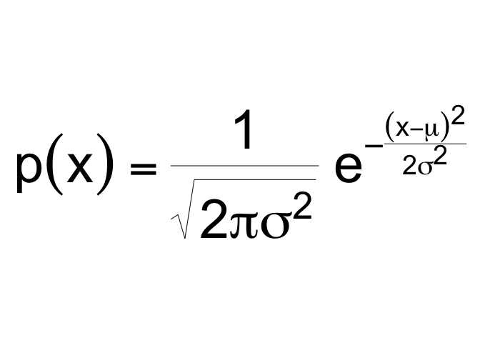

See also:
<https://github.com/EvaMaeRey/ay_2023_2_advanced_individual_study>

## Title

Building an R package to deliver easy-to-use equations in prose and
plots for intro to statistics and probability curricula

## Abstract

Mathematical fluency involves frequent use of equations. However, typing
out equations for use in electronic documents can be tedious. In a
classroom setting with a set curriculum, the set of equations to be
mastered is well defined. Having shortcuts to produce this set of
equations in prose or plots could be beneficial for students and
instructors alike. The goal of this independent study is to create
functions that will quickly deliver the typed versions of equations that
translate into beautiful printed versions. We will store the typed
versions and thoughtfully crafted R functions to make these typed out
equations easily accessible. The functions will be bundled into an R
package.

# The problem

Using mathematical notation is a powerful way to communicate about
probabilistic and statistical concept. When notation is combined with
data visualization or descriptive prose that power is even greater.

However, using equations in these contexts is often done by typing in a
typesetting version of the equation that may not be awkward. Consider
the probability density function for the normal distribution, centered
at \(\mu\) with a standard deviation of \(\sigma\):

\[drop rendered version in here\]

The typed version of this equation which follows is a distant cousin
from its beautiful rendered kin above:

`p(x) = \frac{1}{\sqrt{ 2 \pi \sigma^2 }} e^{ - \frac{ (x - \mu)^2 } {2
\sigma^2} }`

Furthermore, if we want to use annotate a plot with this equation, we
would need to use plot math, a different typed syntax.

`p(x) * {phantom() == phantom()} * frac(1, sqrt(2*pi*sigma^{2}, )) *
phantom(.)*e^{phantom() - frac((x - mu)^{2}, 2*sigma^{2})}`

``` r
math_plot_normal <- "p(x) * {phantom() == phantom()} * frac(1, sqrt(2*pi*sigma^{2}, )) * phantom(.)*e^{phantom() - frac((x - mu)^{2}, 2*sigma^{2})} "

library(ggplot2)
ggxmean:::stamp_space() + 
  annotate(geom = "label", 
           label = math_plot_normal,
           parse = T,
           x = 2, y = .3) + 
  ggxmean::stamp_normal_dist() + 
  ggstamp::stamp_text_ljust(label = "What is the max of this function?",
                      x = -4, 
                      y = .44)
```

<!-- -->
<!-- Fortunately, a translater exists. -->

<!-- ```{r} -->

<!-- exp_to_plot <- latex2exp::TeX("$p(x) = \\frac{1}{\\sqrt{ 2 \\pi \\sigma^2 }} e^{ - \\frac{ (x - \\mu)^2 } {2 \\sigma^2} }$") -->

<!-- ``` -->

# A different work flow within intro probability and statistics course work…

What if we could call a function to get back the text that will render
to our beautiful equations. For example a function like
`return_equation_normal()` could be called to get the typed version of
the prose and `stamp_eq_normal()` for use in ggplot2.

``` r
library(ggplot2)
ggxmean:::stamp_space() + 
  stamp_equation_normal() 
```

# Solution: package with key equations

# Details of Our Implementation

``` r
code <- readLines("functions.R")
```

``` r
# Some functions here
```

The equations in the plot were produce in the following fashion (no
functions or package pre-built):

``` r
equation_z_stat_md <- "$z=\\frac{\\hat{p}-\\pi}{SD_{null}}$, where $SD_{null}=\\sqrt{\\frac{\\pi_{0}*(1-\\pi_{0})}{n}}$"

equation_z_stat_plot <- latex2exp::TeX(equation_z_stat_md)

equation_conf_interval_z_md <- "$CI = \\hat{p}\\pm Multiplier*SE$, where $SE = \\sqrt{\\frac{\\hat{p}*(1-\\hat{p})}{n}}$"

equation_conf_interval_z_plot <- latex2exp::TeX(equation_conf_interval_z_md)


library(tidyverse)

ggplot() +
  annotate("label", 
           x = 0, y = 0, 
           label = equation_z_stat_plot, 
           color = "grey25", size = 4)
```

<!-- -->

``` r
ggplot() +
  annotate("label", 
           x = 0, y = 0, 
           label = equation_conf_interval_z_plot, 
           color = "grey25", size = 4)
```

<!-- -->

\(\sqrt{3x-1}+(1+x)^2\)

\(z=\frac{\hat{p}-\pi}{SD_{null}}\), where
\(SD_{null}=\sqrt{\frac{\pi_{0}*(1-\pi_{0})}{n}}\)

\[\alpha\]

# How do we write a package?

  - We will still follow the steps outlined in this data package readme:
    <https://github.com/EvaMaeRey/tidytitanic>
  - As well as consult the package building guide:
    <https://evamaerey.github.io/package_in_20_minutes/package_in_20_minutes>

## Which equations are relevant for the statistics and probability course?

A good start for looking at the core of equations used in ma206 is the
code annex:

  - Rendered: <https://evamaerey.github.io/ma206/code_annex.html>
  - Source:
    <https://github.com/EvaMaeRey/ma206/blob/master/code_annex.Rmd>

Result would be to quickly include relevant formulas in plots (like
ggplot below which looks at proposal 1/3 as null hypothesis for a
proportion) and .rmd documents.

# Project timeline

| Timing      | Activity and Deliverable                                                                                           | Hours |
| ----------- | ------------------------------------------------------------------------------------------------------------------ | ----- |
| 0-3 weeks   | Background on writing functions in R and package architecture                                                      | 15    |
| 3-6 weeks   | ggplot2 programming basics, math type interface                                                                    | 15    |
| 6-10 weeks  | Building functionality for returning intro to stats and probability equations easily from R for documents and plot | 15    |
| 10-12 weeks | Showcasing and soliciting feedback                                                                                 | 15    |
| 12-15 weeks | Incorporating feedback                                                                                             | 10    |
| Final       | Report and presentation.                                                                                           | 10    |

# How do we collaborate and share the package?

  - create a github account for collaboration <https://github.com/>
  - we’ll make the repository available in this account
