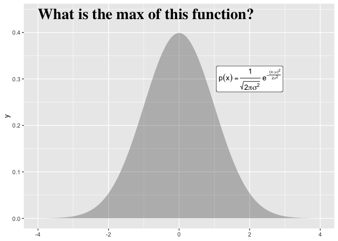
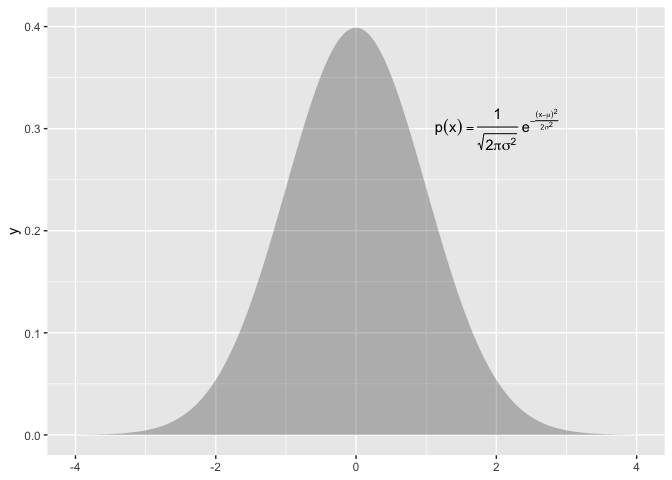

<!-- README.md is generated from README.Rmd. Please edit that file -->

# ma206equations 

[](https://lifecycle.r-lib.org/articles/stages.html#experimental)

Delivering type-setting equations in prose and plots as functions for
statistics and probability curricula

## Abstract

Mathematical fluency involves frequent use of equations. However, typing
out equations for use in electronic documents can be tedious. In a
classroom setting with a set curriculum, the set of equations to be
mastered is well defined. Having shortcuts to produce this set of
equations in prose or plots could be beneficial for students and
instructors alike. The goal of this independent study is to create
functions that will quickly deliver the typed versions of equations that
translate into beautiful printed versions. We will store the typed
versions and thoughtfully crafted R functions to make these typed
equations easily accessible. The functions will be bundled into an R
package.

# The problem

Using mathematical notation is a powerful way to communicate about
probabilistic and statistical concept. When notation is combined with
data visualization or descriptive prose that power is even greater.

However, using equations in these contexts is often done by typing in a
typesetting version of the equation; this can be awkward. Consider the
probability density function for the normal distribution, centered at
 with a standard deviation of
:


The typed version of this equation which follows is a distant cousin
from its beautiful rendered kin above:

`p(x) = \frac{1}{\sqrt{ 2 \pi \sigma^2 }} e^{ - \frac{ (x - \mu)^2 } {2
\sigma^2} }`

Furthermore, if we want to use annotate a plot with this equation, we
would need to use plotmath, a completely different type setting system.

`p(x) * {phantom() == phantom()} * frac(1, sqrt(2*pi*sigma^{2}, )) *
phantom(.)*e^{phantom() - frac((x - mu)^{2}, 2*sigma^{2})}`

``` r
library(ggplot2)
ggxmean:::stamp_space() + 
  ggxmean::stamp_normal_dist() +
  annotate(geom = "text", 
           label = "p(x) * {phantom() == phantom()} * frac(1, sqrt(2*pi*sigma^{2}, )) * phantom(.)*e^{phantom() - frac((x - mu)^{2}, 2*sigma^{2})} ",
           parse = T,
           x = 2, y = .3)
```



# A different work flow within intro probability and statistics course work…

What if we could call a function to get back the text that will render
to our beautiful equations. For example a function like
`typeset_eq_normal()` could be called to get the typed version of the
prose and `stamp_eq_normal()` for use in ggplot2.

Our package ma206equations delivers exactly this. ma206equations
delivers tex version of equations that can be used in prose, as shown
here:

``` r
ma206equations::typeset_eq_normal()
#> $p(x) = \frac{1}{\sqrt{ 2 \pi \sigma^2 }} e^{ - \frac{ (x - \mu)^2 } {2 \sigma^2} }$
```

Educators can call this equation and then copy and paste into hybrid
prose-code documents, or use in-line code to return the equation
dynamically:   
 = \\frac{1}{\\sqrt{ 2 \\pi \\sigma^2 }} e^{ - \\frac{ (x - \\mu)^2 } {2 \\sigma^2} }")  

``` default
This is an example of how to return an equation inline: 
  
`r ma206equations::typeset_eq_normal(inline = TRUE)`
```

This is an example of how to return an equation inline:  = \\frac{1}{\\sqrt{ 2 \\pi \\sigma^2 }} e^{ - \\frac{ (x - \\mu)^2 } {2 \\sigma^2} }")

To use equations in a plotting context, ma206equations provides
stamp\_eq\_\*() functions. An example of how to print the normal
distribution equation with ma206equations follows:

``` r
library(ggplot2)
library(ma206equations)
ggxmean:::stamp_space() + 
  ma206equations::stamp_eq_normal(x = 2, y = .3) + 
  ggxmean::stamp_normal_dist()
```



# metaprogramming maintanance strategy: code that writes code

At first we worked on writing functions one by one. However, doing so
for the large number of equations that we thought might be useful did
not seems sustainable. Therefore we turned to a meta-programming:

> Meta-Programming is a programming technique in which computer programs
> have the ability to treat programs as their data.It means that a
> program can be designed to read, generate, analyse or transform other
> programs, and even modify itself while running. Meta Programming is
> about writing code that writes code. (Anshul Vyas)

The meta programming files are included in data-raw folder of this
package. The components are

1)  spreadsheet of equations of interest for ma206, descriptions etc.
2)  function composition and testing files
3)  function template files
4)  r package function generation code from templates and spreadsheet

## 1 ‘data’ collection

A large part of this project was thinking about which equations are
relevant for a course like ma206.

``` r
read.csv("data-raw/ma389_stats_formulas.csv") |>
  dplyr::select(-long_description) |>
  tail(7) |> 
  knitr::kable()
```

|    |  X | mathjax                                                                                                                                                                                                                                                                                                                                                                                                                                                                                            | description            | context                               | plotmath                                                                                                                                                                               | stamp\_function\_name |
| :- | -: | :------------------------------------------------------------------------------------------------------------------------------------------------------------------------------------------------------------------------------------------------------------------------------------------------------------------------------------------------------------------------------------------------------------------------------------------------------------------------------------------------- | :--------------------- | :------------------------------------ | :------------------------------------------------------------------------------------------------------------------------------------------------------------------------------------- | :-------------------- |
| 10 | 10 | ![E\[X\] = x\_1p\_1 + x\_2p\_2 + x\_3p\_3 ...x\_np\_n = \\\\sum\_1^n{x\_ip\_i}](https://latex.codecogs.com/png.image?%5Cdpi%7B110%7D&space;%5Cbg_white&space;E%5BX%5D%20%3D%20x_1p_1%20%2B%20x_2p_2%20%2B%20x_3p_3%20...x_np_n%20%3D%20%5C%5Csum_1%5En%7Bx_ip_i%7D "E[X] = x_1p_1 + x_2p_2 + x_3p_3 ...x_np_n = \\\\sum_1^n{x_ip_i}")                                                                                                                                                              | Expected Value         | Probability Distributions             | E \* ‘\[’ *X * ’\]’ \* {phantom() == phantom()} \* x\[1\]*p\[1\] + x\[2\]*p\[2\] + x\[3\]*p\[3\]*…x\[n\]*p\[n\] * {phantom() == phantom()} \* sum(x\[i\]\*p\[i\], 1, n)                | stamp\_eq\_ev         |
| 11 | 11 | ![Var(X) = E\[(X-\\\\mu)^2\] = \\\\sigma^2\_x = \\\\sum\_1^n(x\_i-\\\\mu)^2p\_i](https://latex.codecogs.com/png.image?%5Cdpi%7B110%7D&space;%5Cbg_white&space;Var%28X%29%20%3D%20E%5B%28X-%5C%5Cmu%29%5E2%5D%20%3D%20%5C%5Csigma%5E2_x%20%3D%20%5C%5Csum_1%5En%28x_i-%5C%5Cmu%29%5E2p_i "Var(X) = E[(X-\\\\mu)^2] = \\\\sigma^2_x = \\\\sum_1^n(x_i-\\\\mu)^2p_i")                                                                                                                                 | Variance               | Description of the spread of the Data | Var(X) \* {phantom() == phantom()} \* E \* ‘\[’ *(X - mu)^{2} * ’\]’ \* {phantom() == phantom()} \* sigma\[x\]^{2} \* {phantom() == phantom()} \* sum(, 1, n)*(x\[i\] - mu)^{2}*p\[i\] | stamp\_eq\_var        |
| 12 | 12 |  = \\\\sqrt{Var(X)}")                                                                                                                                                                                                                                                               | standard deviation     | Description of the spread of the Data | sigma\[x\] \* {phantom() == phantom()} \* SD(X) \* {phantom() == phantom()} \* sqrt(Var(X), )                                                                                          | stamp\_eq\_sd         |
| 13 | 13 |  = \\\\frac{1}{\\\\sqrt{ 2 \\\\pi \\\\sigma^2 }} e^{ - \\\\frac{ (x - \\\\mu)^2 } {2 \\\\sigma^2} }") | Normal Distribution    | Probability                           | p(x) \* {phantom() == phantom()} \* frac(1, sqrt(2*pi*sigma^{2}, )) \* phantom(.)*e^{phantom() - frac((x - mu)^{2}, 2*sigma^{2})}                                                      | stamp\_eq\_normal     |
| 14 | 14 |                                                                                                                                                                                                                                                                                      | Binomial Distribution  | Probability                           | {{{}\[N\]}*C * {{}\[k\]}} %.% p^{k}\*q^{N - k}                                                                                                                                         | stamp\_eq\_binomial   |
| 15 | 15 | ^(n-1)*p")                                                                                                                                                                                                                                                                                                                                                          | Geometric Distribution | Probability                           | (1 - p)^{n - 1} \~ symbol(’\*’) \~ p                                                                                                                                                   | stamp\_eq\_geometric  |
| 16 | 16 | !)")                                                                                                                                                                                                                                                                                                                                     | Choose Equation        | Probability                           | {}\[n\]*C\[r\] * {phantom() == phantom()} \* frac(n*‘\!’, r*’\!’(n - r)\*‘\!’)                                                                                                         | stamp\_eq\_choose     |

## 2\. Work on specific functions that serve as a reference for how remainder should look.

Here we just considered specific functions:
[here](https://github.com/EvaMaeRey/ma206equations/blob/main/data-raw/plotmath_functions_playpen.Rmd).

## 3\. Write templates for generating a lot of functions and their documentation

``` r
# for preparation of stamp functions
readLines("data-raw/plotmath_equations_template.txt")
#>  [1] "# Note: do not edit .R file directly; file created from equations_temlapte.txt file"
#>  [2] ""                                                                                   
#>  [3] "#' function_name_from_spreadsheet"                                                  
#>  [4] "#'"                                                                                 
#>  [5] "#' @description full_description_from_spreadsheet"                                  
#>  [6] "#'"                                                                                 
#>  [7] "#' @param x a numeric indicating position on x axis"                                
#>  [8] "#' @param y a numeric indicating position on y axis"                                
#>  [9] "#' @param ..."                                                                      
#> [10] "#'"                                                                                 
#> [11] "#' @return a ggplot2 annotation layer which is the plotmath version of a function"  
#> [12] "#' @export"                                                                         
#> [13] "#'"                                                                                 
#> [14] "#' @examples"                                                                       
#> [15] "#' library(ggplot2)"                                                                
#> [16] "#' ggplot() +"                                                                      
#> [17] "#'    function_name_from_spreadsheet()"                                             
#> [18] "function_name_from_spreadsheet <- function(x = 0,  y = 0, ...){"                    
#> [19] ""                                                                                   
#> [20] "  plotmath_input <- \"plotmath_input_from_spreadsheet\""                            
#> [21] ""                                                                                   
#> [22] "  ggplot2::annotate(geom = \"text\","                                               
#> [23] "           label = plotmath_input,"                                                 
#> [24] "           parse = T,"                                                              
#> [25] "           x = x, y = y, ... )"                                                     
#> [26] ""                                                                                   
#> [27] "}"
```

## 4\. Use template and spreadsheet w/ meta code to create package functions

To see exactly how we used the template to generate all the functions
for this package, see the processing code
[here](https://github.com/EvaMaeRey/ma206equations/blob/main/data-raw/process_excel_file.Rmd).

The function files are the following:

``` r
list.files("R/")
#>  [1] "stamp_eq_binomial.R"                 "stamp_eq_choose.R"                  
#>  [3] "stamp_eq_ci.R"                       "stamp_eq_ev.R"                      
#>  [5] "stamp_eq_geometric.R"                "stamp_eq_normal.R"                  
#>  [7] "stamp_eq_sd_null_t_test.R"           "stamp_eq_sd_null_z_test.R"          
#>  [9] "stamp_eq_sd.R"                       "stamp_eq_se_t_test.R"               
#> [11] "stamp_eq_se_z_test.R"                "stamp_eq_var.R"                     
#> [13] "stamp_sd_null_2_sample_t_test.R"     "stamp_sd_null_two_sample_t_test.R"  
#> [15] "stamp_se_two_sample_t_test.R"        "stamp_statistic.R"                  
#> [17] "typeset_eq_binomial.R"               "typeset_eq_choose.R"                
#> [19] "typeset_eq_ci.R"                     "typeset_eq_ev.R"                    
#> [21] "typeset_eq_geometric.R"              "typeset_eq_normal.R"                
#> [23] "typeset_eq_sd_null_t_test.R"         "typeset_eq_sd_null_z_test.R"        
#> [25] "typeset_eq_sd.R"                     "typeset_eq_se_t_test.R"             
#> [27] "typeset_eq_se_z_test.R"              "typeset_eq_var.R"                   
#> [29] "typeset_sd_null_2_sample_t_test.R"   "typeset_sd_null_two_sample_t_test.R"
#> [31] "typeset_se_two_sample_t_test.R"      "typeset_statistic.R"
```

-----

<!-- Fortunately, a translater exists. -->

<!-- ```{r} -->

<!-- exp_to_plot <- latex2exp::TeX("$p(x) = \\frac{1}{\\sqrt{ 2 \\pi \\sigma^2 }} e^{ - \\frac{ (x - \\mu)^2 } {2 \\sigma^2} }$") -->

<!-- ``` -->

# More fun ideas for selling the project\!

Consider Ian Stewart’s poster below, ‘Equations that changed the world.’
We see the equations themselves and a verbal way to refer to the
equations - the equation’s name. The typesetting version, thankfully,
does not appear.

In a setting where you are using software, it might be preferable to
refer to the equation by name rather than always typing of the
typesetting version. For example `typeset_pathagoreans()` could return
`$ a^2 + b^2 = c^2 $` which could be copy and pasted or used dynamically
in a hybrid prose/code document like jupiter notebooks, rmarkdown, or
quarto.

``` r
knitr::include_graphics("man/figures/equations_that_changed_world.png")
```


-----

``` r
knitr::include_graphics("https://i.kym-cdn.com/photos/images/newsfeed/001/179/540/554.jpg")
```


‘After the math symbols were added, the image and gif surged in
popularity, particularly on Brazilian parts of social media, before it
grew popular worldwide.’
“<https://knowyourmeme.com/memes/math-lady-confused-lady>”

Chat GPT prompt: Why is the ‘when a woman says she’s 29 weeks pregnant’
meme funny?

> The “when a woman says she’s 29 weeks pregnant” meme is a humorous
> observation on the specificity with which women tend to describe their
> pregnancy progress. The joke is that a woman who says she is 29 weeks
> pregnant is providing a level of detail that is more than necessary
> for most people, and can be seen as somewhat comical.

> The meme often features a photo or image of a person with a confused
> or bewildered expression, with text overlayed that reads something
> along the lines of “me trying to figure out how many months that is.”
> The humor comes from the idea that it can be difficult for people who
> are not pregnant or familiar with pregnancy terminology to understand
> what is meant by phrases like “29 weeks.”

> In short, the meme is funny because it pokes fun at the precision with
> which pregnant women tend to describe their pregnancy progress, and
> the confusion that can result when that level of detail is shared with
> others who are not as familiar with the terminology.

-----

# Internal project management notes

# Project refereences:

See also:
<https://github.com/EvaMaeRey/ay_2023_2_advanced_individual_study>

# How do we write a package?

  - We will still follow the steps outlined in this data package readme:
    <https://github.com/EvaMaeRey/tidytitanic>
  - As well as consult the package building guide:
    <https://evamaerey.github.io/package_in_20_minutes/package_in_20_minutes>

## Which equations are relevant for the statistics and probability course?

A good start for looking at the core of equations used in ma206 is the
code annex:

  - Rendered: <https://evamaerey.github.io/ma206/code_annex.html>
  - Source:
    <https://github.com/EvaMaeRey/ma206/blob/master/code_annex.Rmd>

Result would be to quickly include relevant formulas in plots (like
ggplot below which looks at proposal 1/3 as null hypothesis for a
proportion) and .rmd documents.

# Project timeline

| Timing      | Activity and Deliverable                                                                                           | Hours |
| ----------- | ------------------------------------------------------------------------------------------------------------------ | ----- |
| 0-3 weeks   | Background on writing functions in R and package architecture                                                      | 15    |
| 3-6 weeks   | ggplot2 programming basics, math type interface                                                                    | 15    |
| 6-10 weeks  | Building functionality for returning intro to stats and probability equations easily from R for documents and plot | 15    |
| 10-12 weeks | Showcasing and soliciting feedback                                                                                 | 15    |
| 12-15 weeks | Incorporating feedback                                                                                             | 10    |
| Final       | Report and presentation.                                                                                           | 10    |

# How do we collaborate and share the package?

  - create a github account for collaboration <https://github.com/>
  - we’ll make the repository available in this account
