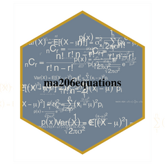
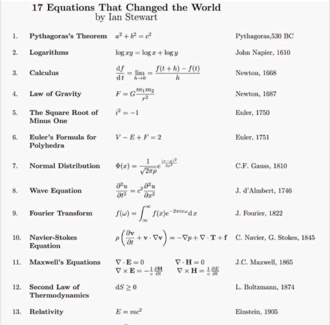

<!-- README.md is generated from README.Rmd. Please edit that file -->

# ma206equations 

Delivering type-setting equations in prose and plots as functions for
statistics and probability curricula

## Abstract

Mathematical fluency involves frequent use of equations. However, typing
out equations for use in electronic documents can be tedious. In a
classroom setting with a set curriculum, the set of equations to be
mastered is well defined. Having shortcuts to produce this set of
equations in prose or plots could be beneficial for students and
instructors alike. The goal of this independent study is to create
functions that will quickly deliver the typed versions of equations that
translate into beautiful printed versions. We will store the typed
versions and thoughtfully crafted R functions to make these typed
equations easily accessible. The functions will be bundled into an R
package.

# The problem

Using mathematical notation is a powerful way to communicate about
probabilistic and statistical concept. When notation is combined with
data visualization or descriptive prose that power is even greater.

However, using equations in these contexts is often done by typing in a
typesetting version of the equation; this can be awkward. Consider the
probability density function for the normal distribution, centered at
 with a standard deviation of
:


The typed version of this equation which follows is a distant cousin
from its beautiful rendered kin above:

`p(x) = \frac{1}{\sqrt{ 2 \pi \sigma^2 }} e^{ - \frac{ (x - \mu)^2 } {2
\sigma^2} }`

Furthermore, if we want to use annotate a plot with this equation, we
would need to use plot math, a different typed syntax.

`p(x) * {phantom() == phantom()} * frac(1, sqrt(2*pi*sigma^{2}, )) *
phantom(.)*e^{phantom() - frac((x - mu)^{2}, 2*sigma^{2})}`

``` r
math_plot_normal <- "p(x) * {phantom() == phantom()} * frac(1, sqrt(2*pi*sigma^{2}, )) * phantom(.)*e^{phantom() - frac((x - mu)^{2}, 2*sigma^{2})} "

library(ggplot2)
ggxmean:::stamp_space() + 
  annotate(geom = "label", 
           label = math_plot_normal,
           parse = T,
           x = 2, y = .3) + 
  ggxmean::stamp_normal_dist() + 
  ggstamp::stamp_text_ljust(label = "What is the max of this function?",
                      x = -4, 
                      y = .44)
```


<!-- Fortunately, a translater exists. -->

<!-- ```{r} -->

<!-- exp_to_plot <- latex2exp::TeX("$p(x) = \\frac{1}{\\sqrt{ 2 \\pi \\sigma^2 }} e^{ - \\frac{ (x - \\mu)^2 } {2 \\sigma^2} }$") -->

<!-- ``` -->

Consider Ian Stewart’s poster below, ‘Equations that changed the world.’
We see the equations themselves and a verbal way to refer to the
equations - the equation’s name. The typesetting version, thankfully,
does not appear.

In a setting where you are using software, it might be preferable to
refer to the equation by name rather than always typing of the
typesetting version. For example `typeset_pathagoreans()` could return
`$ a^2 + b^2 = c^2 $` which could be copy and pasted or used dynamically
in a hybrid prose/code document like jupiter notebooks, rmarkdown, or
quarto.

``` r

```


# A different work flow within intro probability and statistics course work…

What if we could call a function to get back the text that will render
to our beautiful equations. For example a function like
`return_equation_normal()` could be called to get the typed version of
the prose and `stamp_eq_normal()` for use in ggplot2.

# ‘data’ collection

A large part of this project was thinking about which equations are
relevant for a course like ma206.

``` r
read.csv("data-raw/ma389_stats_formulas.csv") |>
  dplyr::select(-long_description) |>
  tail(7) |> 
  knitr::kable()
```

|    |  X | mathjax                                                                                                                                                                                                                                                                                                                                                                                                                                                                                                  | description            | context                               | plotmath                                                                                                                                                                               | stamp\_function\_name |
| :- | -: | :------------------------------------------------------------------------------------------------------------------------------------------------------------------------------------------------------------------------------------------------------------------------------------------------------------------------------------------------------------------------------------------------------------------------------------------------------------------------------------------------------- | :--------------------- | :------------------------------------ | :------------------------------------------------------------------------------------------------------------------------------------------------------------------------------------- | :-------------------- |
| 10 | 10 | ![E\[X\] = x\_1p\_1 + x\_2p\_2 + x\_3p\_3 ...x\_np\_n = \\\\sum\_1^n{x\_ip\_i}](https://latex.codecogs.com/png.image?%5Cdpi%7B110%7D&space;%5Cbg_white&space;E%5BX%5D%20%3D%20x_1p_1%20%2B%20x_2p_2%20%2B%20x_3p_3%20...x_np_n%20%3D%20%5C%5Csum_1%5En%7Bx_ip_i%7D "E[X] = x_1p_1 + x_2p_2 + x_3p_3 ...x_np_n = \\\\sum_1^n{x_ip_i}")                                                                                                                                                                    | Expected Value         | Probability Distributions             | E \* ‘\[’ *X * ’\]’ \* {phantom() == phantom()} \* x\[1\]*p\[1\] + x\[2\]*p\[2\] + x\[3\]*p\[3\]*…x\[n\]*p\[n\] * {phantom() == phantom()} \* sum(x\[i\]\*p\[i\], 1, n)                | stamp\_eq\_ev         |
| 11 | 11 | ![Var(X) = E\[(X-\\\\mu)^2\] = \\\\sigma^2\_x = \\\\sum\_1^n(x\_i-\\\\mu)^2p\_i](https://latex.codecogs.com/png.image?%5Cdpi%7B110%7D&space;%5Cbg_white&space;Var%28X%29%20%3D%20E%5B%28X-%5C%5Cmu%29%5E2%5D%20%3D%20%5C%5Csigma%5E2_x%20%3D%20%5C%5Csum_1%5En%28x_i-%5C%5Cmu%29%5E2p_i "Var(X) = E[(X-\\\\mu)^2] = \\\\sigma^2_x = \\\\sum_1^n(x_i-\\\\mu)^2p_i")                                                                                                                                       | Variance               | Description of the spread of the Data | Var(X) \* {phantom() == phantom()} \* E \* ‘\[’ *(X - mu)^{2} * ’\]’ \* {phantom() == phantom()} \* sigma\[x\]^{2} \* {phantom() == phantom()} \* sum(, 1, n)*(x\[i\] - mu)^{2}*p\[i\] | stamp\_eq\_var        |
| 12 | 12 |  = \\\\sqrt{Var(X)}")                                                                                                                                                                                                                                                                     | standard deviation     | Description of the spread of the Data | sigma\[x\] \* {phantom() == phantom()} \* SD(X) \* {phantom() == phantom()} \* sqrt(Var(X), )                                                                                          | stamp\_eq\_sd         |
| 13 | 13 |  = \\\\frac{1}{\\\\sqrt{ 2 \\\\pi \\\\sigma^2 }} e^{ - \\\\frac{ (x - \\\\mu)^2 } {2 \\\\sigma^2} }") | Normal Distribution    | Probability                           | p(x) \* {phantom() == phantom()} \* frac(1, sqrt(2*pi*sigma^{2}, )) \* phantom(.)*e^{phantom() - frac((x - mu)^{2}, 2*sigma^{2})}                                                      | stamp\_eq\_normal     |
| 14 | 14 |                                                                                                                                                                                                                                                                                            | Binomial Distribution  | Probability                           | {{{}\[N\]}*C * {{}\[k\]}} %.% p^{k}\*q^{N - k}                                                                                                                                         | stamp\_eq\_binomial   |
| 15 | 15 | ^(n-1)*p")                                                                                                                                                                                                                                                                                                                                                                | Geometric Distribution | Probability                           | (1 - p)^{n - 1} \~ symbol(’\*’) \~ p                                                                                                                                                   | stamp\_eq\_geometric  |
| 16 | 16 | !)")                                                                                                                                                                                                                                                                                                                                           | Choose Equation        | Probability                           | {}\[n\]*C\[r\] * {phantom() == phantom()} \* frac(n*‘\!’, r*’\!’(n - r)\*‘\!’)                                                                                                         | stamp\_eq\_choose     |

``` r

# for preparation of stamp functions
readLines("data-raw/plotmath_equations_template.txt")
#>  [1] "# Note: do not edit .R file directly; file created from equations_temlapte.txt file"
#>  [2] ""                                                                                   
#>  [3] "#' function_name_from_spreadsheet"                                                  
#>  [4] "#'"                                                                                 
#>  [5] "#' @description full_description_from_spreadsheet"                                  
#>  [6] "#'"                                                                                 
#>  [7] "#' @param x a numeric indicating position on x axis"                                
#>  [8] "#' @param y a numeric indicating position on y axis"                                
#>  [9] "#' @param ..."                                                                      
#> [10] "#'"                                                                                 
#> [11] "#' @return a ggplot2 annotation layer which is the plotmath version of a function"  
#> [12] "#' @export"                                                                         
#> [13] "#'"                                                                                 
#> [14] "#' @examples"                                                                       
#> [15] "#' library(ggplot2)"                                                                
#> [16] "#' ggplot() +"                                                                      
#> [17] "#'    function_name_from_spreadsheet()"                                             
#> [18] "function_name_from_spreadsheet <- function(x = 0,  y = 0, ...){"                    
#> [19] ""                                                                                   
#> [20] "  plotmath_input <- \"plotmath_input_from_spreadsheet\""                            
#> [21] ""                                                                                   
#> [22] "  ggplot2::annotate(geom = \"text\","                                               
#> [23] "           label = plotmath_input,"                                                 
#> [24] "           parse = T,"                                                              
#> [25] "           x = x, y = y, ... )"                                                     
#> [26] ""                                                                                   
#> [27] "}"
```

To see exactly how we used the template to generate all the functions
for this package, see the processing code
[here](https://github.com/EvaMaeRey/ma206equations/blob/main/data-raw/process_excel_file.Rmd).

``` r
library(ggplot2)
ggxmean:::stamp_space() + 
  stamp_equation_normal() 
```

# Solution: package with key equations

The equations in the plot were produce in the following fashion (no
functions or package pre-built):

``` r

equation_z_stat_md <- "$z=\\frac{\\hat{p}-\\pi}{SD_{null}}$, where $SD_{null}=\\sqrt{\\frac{\\pi_{0}*(1-\\pi_{0})}{n}}$"

equation_z_stat_plot <- latex2exp::TeX(equation_z_stat_md)

equation_conf_interval_z_md <- "$CI = \\hat{p}\\pm Multiplier*SE$, where $SE = \\sqrt{\\frac{\\hat{p}*(1-\\hat{p})}{n}}$"

equation_conf_interval_z_plot <- latex2exp::TeX(equation_conf_interval_z_md)


library(tidyverse)

ggplot() +
  annotate("label", 
           x = 0, y = 0, 
           label = equation_z_stat_plot, 
           color = "grey25", size = 4)
```


``` r

ggplot() +
  annotate("label", 
           x = 0, y = 0, 
           label = equation_conf_interval_z_plot, 
           color = "grey25", size = 4)
```


^2")

, where
}{n}}")

  
  

-----

# Project refereences:

See also:
<https://github.com/EvaMaeRey/ay_2023_2_advanced_individual_study>

# How do we write a package?

  - We will still follow the steps outlined in this data package readme:
    <https://github.com/EvaMaeRey/tidytitanic>
  - As well as consult the package building guide:
    <https://evamaerey.github.io/package_in_20_minutes/package_in_20_minutes>

## Which equations are relevant for the statistics and probability course?

A good start for looking at the core of equations used in ma206 is the
code annex:

  - Rendered: <https://evamaerey.github.io/ma206/code_annex.html>
  - Source:
    <https://github.com/EvaMaeRey/ma206/blob/master/code_annex.Rmd>

Result would be to quickly include relevant formulas in plots (like
ggplot below which looks at proposal 1/3 as null hypothesis for a
proportion) and .rmd documents.

# Project timeline

| Timing      | Activity and Deliverable                                                                                           | Hours |
| ----------- | ------------------------------------------------------------------------------------------------------------------ | ----- |
| 0-3 weeks   | Background on writing functions in R and package architecture                                                      | 15    |
| 3-6 weeks   | ggplot2 programming basics, math type interface                                                                    | 15    |
| 6-10 weeks  | Building functionality for returning intro to stats and probability equations easily from R for documents and plot | 15    |
| 10-12 weeks | Showcasing and soliciting feedback                                                                                 | 15    |
| 12-15 weeks | Incorporating feedback                                                                                             | 10    |
| Final       | Report and presentation.                                                                                           | 10    |

# How do we collaborate and share the package?

  - create a github account for collaboration <https://github.com/>
  - we’ll make the repository available in this account

<!-- end list -->

``` r
plotmath_ev <- latex2exp::TeX("$E[X] = x_1p_1 + x_2p_2 + x_3p_3 ...x_np_n = \\sum_1^n{x_ip_i}$")
plotmath_var <- latex2exp::TeX("$Var(X) = E[(X-\\mu)^2] = \\sigma^2_x = \\sum_1^n(x_i-\\mu)^2p_i$")
plotmath_sd <- latex2exp::TeX("$\\sigma_x = SD(X) = \\sqrt{Var(X)}$")


### stamp equation example
stamp_one_plus_one <- function(x = 0, y = 0, ...){

  annotate(geom = "text",
           label = "1 + 1",
           parse = T,
           x = x, y = y, ...)

}

library(tidyverse)
ggplot2::ggplot() +
  stamp_one_plus_one() +
  stamp_one_plus_one(size = 12, y = 2)
```


``` r


tibble::tibble(event = c("totaled", "fender bender", "accident free"),
       probability = c(.01, .09, .9),
       payout = c(20000, 5000, 0)) ->
  expected


expected %>%
  ggplot() +
  aes(x = payout, y = probability) +
  geom_point() +
  geom_segment(aes(xend = payout, yend = 0)) +
  geom_text(aes(label = probability), size = 5,
            vjust = -.5, color = "black") +
  geom_vline(xintercept = sum(c(.01*20000, .09*5000)),
             linetype = "dashed", color = "black") +
  labs(subtitle = "Course idea 8:  The expected value E.V. is the 'balancing point' of a Random variable, X.  It is the weighted average of values, (weighting values by their probabilities). In large samples from the X, the average will be close to the E.V.;" %>% str_wrap(60)) +
  annotate(geom = "label", x =sum(c(.01*20000, .09*5000)), label = sum(c(.01*20000, .09*5000)), y = .5 ) +
  scale_y_continuous(limits = c(0,1)) +
  annotate(geom = "text", label = "E * '[' *X * ']' * {phantom() == phantom()} * x[1]*p[1] + x[2]*p[2] + x[3]*p[3]*...x[n]*p[n] * {phantom() == phantom()} * sum(x[i]*p[i], 1, n) ", parse = T,
           x = 12000, y = .95) +
  annotate(geom = "text", label = "Var(X) * {phantom() == phantom()} * E * '[' *(X - mu)^{2} * ']' * {phantom() == phantom()} * sigma[x]^{2} * {phantom() == phantom()} * sum(, 1, n)*(x[i] - mu)^{2}*p[i] ", parse = T,
           x = 12000, y = .8) +
  annotate(geom = "text", label = "sigma[x] * {phantom() == phantom()} * SD(X) * {phantom() == phantom()} * sqrt(Var(X), ) ", parse = T,
           x = 12000, y = .65)
```


``` r


stamp_eq_ev <- function(x = 0,  y = 0){

  # your work here

}


stamp_eq_var <- function(x = 0,  y = 0){

  # your work here

}

stamp_eq_sd <- function(x = 0,  y = 0){

  # your work here

}


ggplot() +
  stamp_eq_ev() +
  stamp_eq_var(y = -1)+
  stamp_eq_sd(y = -2)
```


